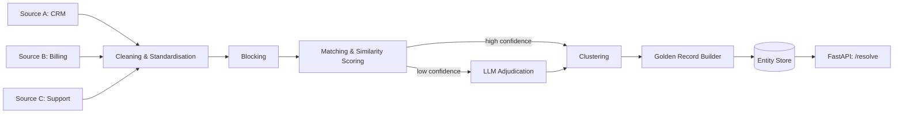

# Master Data Cleanup Engine

**An end-to-end entity resolution system that finds duplicate customer, vendor and product records across messy data sources, merges them into a single golden record, and serves a canonical entity ID through a real-time API.**


---

## The problem

Most companies store the same customer, vendor or product several times across their CRM, billing and support systems, with typos, abbreviations and missing fields ("Acme Corp." vs "ACME Corporation Ltd"). These duplicates cause:

- Wrong analytics and inflated customer counts
- Duplicate invoices and payments
- Broken personalisation and poor customer experience

Matching every record against every other record is too slow at scale, and simple exact-match rules miss most real duplicates.

## What this project does

| Stage | What happens |
|---|---|
| **Ingestion** | Loads records from multiple sources (CSV / database tables) and standardises names, addresses and IDs |
| **Blocking** | Groups likely matches together so only a small fraction of all record pairs are compared |
| **Matching** | Scores candidate pairs using string and embedding similarity |
| **LLM adjudication** | Sends only low-confidence pairs to an LLM for a match / no-match decision with a reason |
| **Clustering** | Groups matched records into entities |
| **Golden record** | Merges each entity into one clean record using field-level survivorship rules |
| **Serving** | FastAPI endpoint returns the canonical entity ID for any incoming record |

## Architecture



## Tech stack

- **Entity resolution:** [pyJedAI](https://github.com/AI-team-UoA/pyJedAI) (blocking, matching, clustering)
- **Data processing:** Python, Pandas
- **LLM adjudication:** LLM API with structured JSON output
- **Serving:** FastAPI, Uvicorn
- **Packaging:** Docker

## Project structure

```
master-data-cleanup-engine/
├── data/                 # benchmark and sample datasets
├── notebooks/            # exploration and evaluation notebooks
├── src/
│   ├── ingest.py         # loading and standardisation
│   ├── pipeline.py       # blocking, matching, clustering (pyJedAI)
│   ├── adjudicate.py     # LLM review of low-confidence pairs
│   ├── golden_record.py  # survivorship rules and merging
│   └── api.py            # FastAPI service
├── tests/
├── Dockerfile
├── requirements.txt
└── README.md
```

## Getting started

```bash
git clone https://github.com/InfinityM10/master-data-cleanup-engine.git
cd master-data-cleanup-engine
pip install -r requirements.txt
```

Run the resolution pipeline:

```bash
python src/pipeline.py --config configs/default.yaml
```

Start the API:

```bash
uvicorn src.api:app --reload
```

Or with Docker:

```bash
docker build -t data-cleanup-engine .
docker run -p 8000:8000 data-cleanup-engine
```

## API example

```bash
curl -X POST http://localhost:8000/resolve \
  -H "Content-Type: application/json" \
  -d '{"name": "ACME Corporation Ltd", "city": "Bangalore", "email": "billing@acme.com"}'
```

```json
{
  "entity_id": "ENT-000123",
  "match_confidence": 0.94,
  "golden_record": {
    "name": "Acme Corporation",
    "city": "Bangalore",
    "email": "billing@acme.com"
  }
}
```

## Results

Evaluated on standard entity resolution benchmarks.

| Dataset | Comparisons reduced by blocking | Precision | Recall | F1 |
|---|---|---|---|---|
| Abt-Buy | _add_ | _add_ | _add_ | _add_ |
| DBLP-ACM | _add_ | _add_ | _add_ | _add_ |

| Setup | F1 | Pairs sent to human review |
|---|---|---|
| Without LLM adjudication | _add_ | _add_ |
| With LLM adjudication | _add_ | _add_ |

## Roadmap

- [ ] Active learning loop for human-reviewed pairs
- [ ] Incremental matching for new records without full re-runs
- [ ] Data quality report before and after cleanup

## Acknowledgements

This project is built on top of **[pyJedAI](https://github.com/AI-team-UoA/pyJedAI)**, an open-source entity resolution library developed by the [AI-Team](https://ai.di.uoa.gr) at the University of Athens and released under the Apache-2.0 license. All credit for the core blocking, matching and clustering algorithms goes to its authors.

> Nikoletos, K., Papadakis, G., & Koubarakis, M. (2022). *pyJedAI: a Lightsaber for Link Discovery.* ISWC 2022 Posters, Demos and Industry Tracks. [Paper](https://ceur-ws.org/Vol-3254/paper366.pdf)

## License

Released under the Apache-2.0 license. See [LICENSE](LICENSE).
